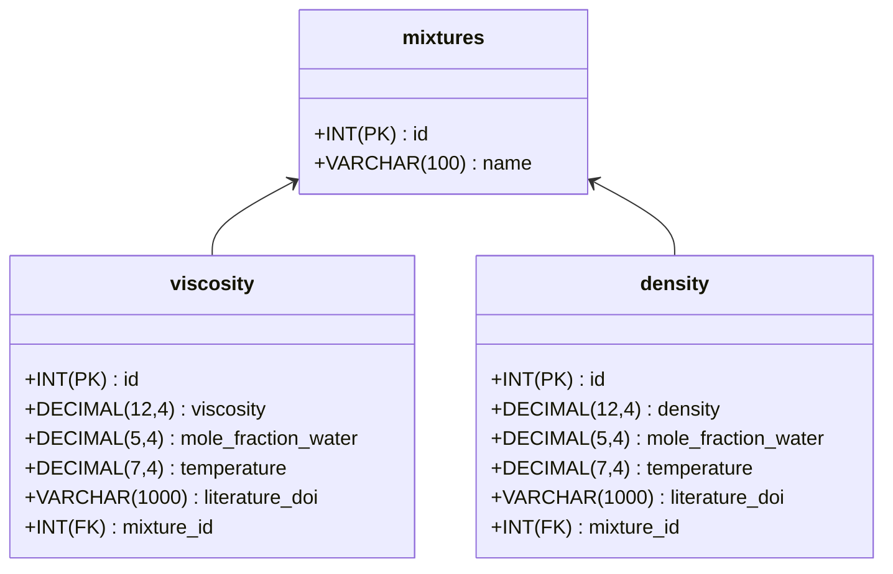

# WissMeth I: Datenbankvorlesung

Dieses Repository enthält alle notwendigen Skripte und Daten, um eine MySQL-Datenbank zu starten und zu befüllen. Diese Datenbank wird für die Datenbankvorlesung in WissMeth I verwendet und implementiert ein einfaches Mischungsdatenmodell mit Dichten und Viskositäten (siehe [Datenmodell](#datenmodell)).

## Inhalt

- [`docker-compose.yml`](./docker-compose.yml): Docker Compose Datei, um die Datenbank und phpMyAdmin zu starten.
- [`tutorials`](./tutorials): Tutorials, die die Verwendung der Datenbank und die grundlegenden Konzepte der Datenbanken erklären.

## Verwendung

Führen Sie einfach `docker compose up -d` aus, um die Datenbank zu starten und mit Daten zu befüllen. Bitte beachten Sie, dass Docker auf Ihrem System installiert sein muss und eine laufende Docker-Engine vorhanden sein muss, damit dies funktioniert.

### Umgebungsvariablen

```bash
# MySQL Konfiguration
MYSQL_ROOT_PASSWORD=supersecurepassword
MYSQL_DATABASE=mixtures
MYSQL_USER=wissmeth
MYSQL_PASSWORD=wissmeth

# phpMyAdmin Konfiguration
PMA_HOST=mysql
PMA_PORT=3306
```

## Datenmodell


