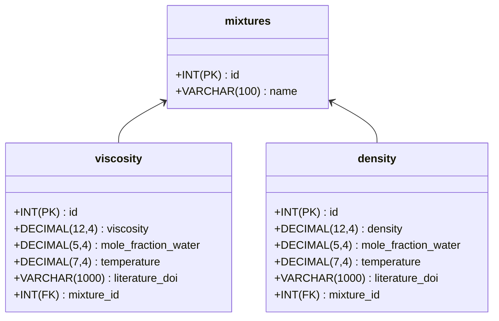

# WissMeth I: Database lecture

This repository contains all necessary scripts and data to spin up a MySQL database and populate it.

## Usage

Simply run the `docker compose up -d` to spin up the database and populate it with data. Please note, for this to work, you need to have docker installed on your system and a running docker engine.

## DataModel

